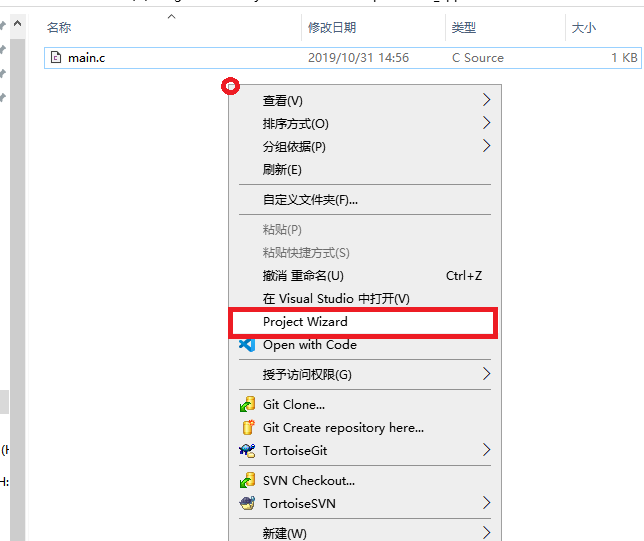
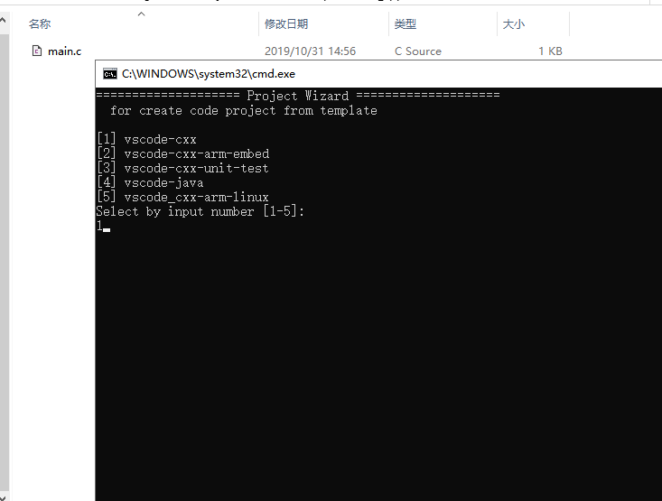
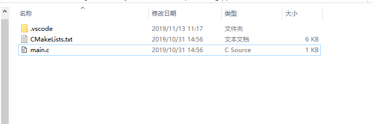

ProjectWizard 
=============

一个很简单的小工具，用于从模板创建代码工程

安装说明
--------
0. 安装nodejs，并添加node.exe所在目录到PATH环境变量
1. 运行Register.bat，会生成Register.reg
2. 双击Register.reg，导入到注册表
3. 将自己需要的代码工程模板放到Template目录下

使用说明
---------

1. 在目录空白处点击右键，点Project Wizard

2. 输入数字按回车，来选择需要的模板

3. 最终代码工程相关文件就生成了

